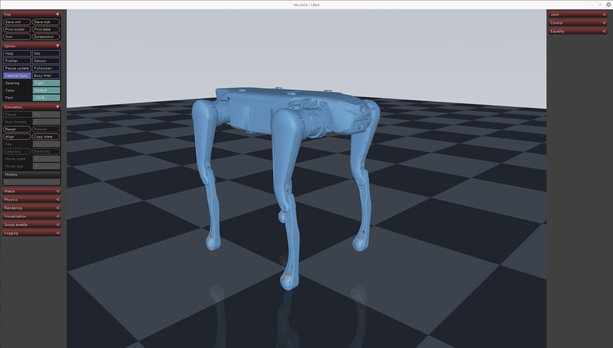

# quadruped_robot

`quadruped_robot` 是一个专注于 **DeepRobotics Lite3** 的强化学习运动控制工程。工程以
Isaac Sim / Isaac Lab 为仿真与任务基础，以 RSL-RL PPO 为训练入口，覆盖模型管理、速度跟踪
策略训练、量化评测、Sim-to-Sim 验证以及后续 Sim-to-Real 接入。

当前仓库只保留 Lite3。集中维护一套机器人模型和训练配置，有利于持续校准仿真参数、奖励、
观测、命令分布和部署接口，并用真机实验闭环验证每次修改。



## 支持范围

工程注册两个 Isaac Lab 任务：

```text
QuadrupedRobot-Velocity-Flat-Deeprobotics-Lite3-v0
QuadrupedRobot-Velocity-Rough-Deeprobotics-Lite3-v0
```

| 任务 | 用途 |
| --- | --- |
| Flat | 在无限平面上训练基础站立、前后、横移和转向能力 |
| Rough | 在程序化地形上训练地形适应能力，并启用地形课程 |

策略输出 12 个关节的位置目标增量，底层由 Lite3 的 PD actuator 配置转换为关节力矩。

## 参考环境

```text
操作系统: Ubuntu 20.04.6 LTS（内核 5.15.0-139）
GPU: NVIDIA GeForce RTX 5070 Ti
显存: 16 GB（驱动 570.133.20）
Python: 3.10.15（Isaac Sim 自带 Python）
Isaac Sim: 4.5.0
Isaac Lab: 2.3.0（isaaclab 扩展 0.48.6）
PyTorch: 2.7.0+cu128
rsl-rl-lib: 3.1.2
Isaac Lab Launcher: /home/robot/isaacsim/IsaacLab/isaaclab.sh
```

本工程直接使用 Isaac Sim 自带的 Python，不需要激活 conda 环境；`isaaclab.sh -p` 会自动
选择正确解释器。

## 工程结构

```text
quadruped_robot/
├── README.md
├── img/lite3.png
├── robot_models/
│   └── deeprobotics/Lite3/
│       ├── Lite3_mjcf/
│       ├── Lite3_urdf/
│       └── Lite3_usd/
├── rl_training/
│   ├── README.md
│   ├── docs/
│   │   ├── isaac_lab_migration.md
│   │   └── lite3_training_strategy.md
│   ├── scripts/
│   │   ├── reinforcement_learning/rsl_rl/
│   │   │   ├── train.py
│   │   │   ├── play.py
│   │   │   └── benchmark.py
│   │   └── tools/
│   │       ├── compare_benchmarks.py
│   │       └── list_envs.py
│   └── source/robot_lab/quadruped_robot/
│       ├── assets/deeprobotics.py
│       └── tasks/manager_based/locomotion/velocity/
└── rl_deploy/
    ├── sim_to_sim/
    └── sim_to_real/
```

训练、部署和可视化共享 `robot_models/deeprobotics/Lite3/` 中的同一套模型资产。

## 安装与任务检查

以下命令默认从 `rl_training/` 目录执行：

```bash
cd /home/robot/pengyingjian_external/quadruped_robot/rl_training

TERM=xterm /home/robot/isaacsim/IsaacLab/isaaclab.sh -p -m pip install \
  --no-build-isolation -e source/robot_lab

TERM=xterm /home/robot/isaacsim/IsaacLab/isaaclab.sh -p \
  scripts/tools/list_envs.py --headless
```

列表中应只有两个 `QuadrupedRobot-Velocity-*` 任务。

## 训练

建议先获得稳定的 Flat 基线，再训练 Rough：

```bash
TERM=xterm /home/robot/isaacsim/IsaacLab/isaaclab.sh -p \
  scripts/reinforcement_learning/rsl_rl/train.py \
  --task QuadrupedRobot-Velocity-Flat-Deeprobotics-Lite3-v0 \
  --headless --num_envs 4096
```

```bash
TERM=xterm /home/robot/isaacsim/IsaacLab/isaaclab.sh -p \
  scripts/reinforcement_learning/rsl_rl/train.py \
  --task QuadrupedRobot-Velocity-Rough-Deeprobotics-Lite3-v0 \
  --headless --num_envs 4096
```

训练输出位于：

```text
logs/rsl_rl/deeprobotics_lite3_{flat|rough}/<run>/
├── model_*.pt
├── events.out.tfevents.*
└── params/
    ├── env.yaml
    └── agent.yaml
```

## 回放与导出

```bash
TERM=xterm /home/robot/isaacsim/IsaacLab/isaaclab.sh -p \
  scripts/reinforcement_learning/rsl_rl/play.py \
  --task QuadrupedRobot-Velocity-Flat-Deeprobotics-Lite3-v0 \
  --checkpoint_path logs/rsl_rl/deeprobotics_lite3_flat/<run>/model_<iteration>.pt
```

键盘控制：`W/S` 前后，`A/D` 横移，`Q/E` 转向，`L` 清零停止；也可使用方向键与 `Z/X`。

导出 ONNX：

```bash
TERM=xterm /home/robot/isaacsim/IsaacLab/isaaclab.sh -p \
  scripts/reinforcement_learning/rsl_rl/play.py \
  --task QuadrupedRobot-Velocity-Flat-Deeprobotics-Lite3-v0 \
  --checkpoint_path logs/rsl_rl/deeprobotics_lite3_flat/<run>/model_<iteration>.pt \
  --export_onnx
```

导出文件默认写入 checkpoint 同级的 `exported/policy.onnx`。

## 量化评测

不要只依赖回放观感或总 reward。`benchmark.py` 会重复评测站立、前后、横移、原地转向和混合
指令，并输出速度误差、机身倾角、足端滑移、动作变化率、关节功率和步态时钟匹配度：

```bash
TERM=xterm /home/robot/isaacsim/IsaacLab/isaaclab.sh -p \
  scripts/reinforcement_learning/rsl_rl/benchmark.py \
  --task QuadrupedRobot-Velocity-Flat-Deeprobotics-Lite3-v0 \
  --checkpoint_path logs/rsl_rl/deeprobotics_lite3_flat/<run>/model_<iteration>.pt \
  --headless --trials 5 --duration_s 8 --warmup_s 2
```

对比多个已评测 run：

```bash
python3 scripts/tools/compare_benchmarks.py \
  --root logs/rsl_rl/deeprobotics_lite3_flat
```

先用第一条完整 Lite3 基线建立验收门槛，再以相同随机种子、命令矩阵、时长和 trial 数比较配置，
避免把仿真波动误认为改进。训练策略与调参顺序见
[Lite3 训练策略](rl_training/docs/lite3_training_strategy.md)。

## Sim-to-Sim

在仓库根目录运行 Lite3 MuJoCo 模型检查：

```bash
conda activate pyj_rl_simtosim
python rl_deploy/sim_to_sim/view_robot.py
python rl_deploy/sim_to_sim/view_robot.py --gravity
```

## Git LFS

Lite3 的 STL 与 USD 资产通过 Git LFS 管理：

```bash
git lfs install
git lfs ls-files
```

## 参考工程

- https://github.com/fan-ziqi/robot_lab
- https://github.com/DeepRoboticsLab/rl_training
